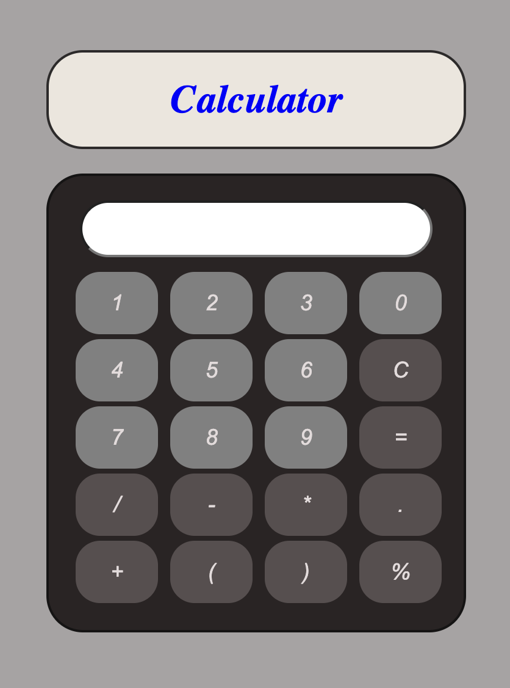

# Calculator App

## Overview

The Calculator App is a web application built using React, providing users with a versatile and user-friendly tool for performing arithmetic calculations.

## Features

- **Basic Arithmetic Operations:**
  The calculator supports standard arithmetic operations, including addition, subtraction, multiplication, and division.

- **Percentage Calculations:**
  Users can easily calculate percentages by entering the desired percentage value using the '%' button.

- **Parentheses Support:**
  The application handles complex expressions by allowing the use of parentheses for proper evaluation.

- **Clear Functionality:**
  The 'C' button clears the input, providing users with a quick and easy way to start a new calculation.

- **Error Handling:**
  The calculator includes robust error handling to alert users when invalid expressions or unbalanced parentheses are detected.
**User-Friendly Interface:**
  The interface is designed for simplicity and ease of use, making it accessible for users of all levels of expertise.

- **Testing with Jest and Playwright:**
  The project incorporates unit testing with Jest and end-to-end testing with Playwright to ensure the reliability and functionality of the application.

- **Responsive Design:**
  The calculator is responsive, providing a seamless experience across various screen sizes and devices.

- **Decimal Point and Dot Operator:**
  Users can input decimal numbers using the '.' button for precise calculations.

- **Accessibility:**
  ARIA labels are implemented for buttons to enhance accessibility for users with disabilities.

- **Dynamic Result Display:**
  The result is dynamically updated as users input calculations, providing real-time feedback.

 

## Tools Used
- **React:** A JavaScript library for building user interfaces.
- **playwright:** An end-to-end testing framework for web applications.
- **Jest and React Testing Library:** Used for unit testing React components.

 ## Navigate to the Project Directory:
calculator/testing-module-project-moelnemr2022

## Install Dependencies:
npm install

## Run the Application:
npm run dev

## Access the Calculator:
Open your web browser and go to http://localhost:5173 to use the calculator

Testing

## Unit Tests
npm run test

## playwright tests
npx playwright test

